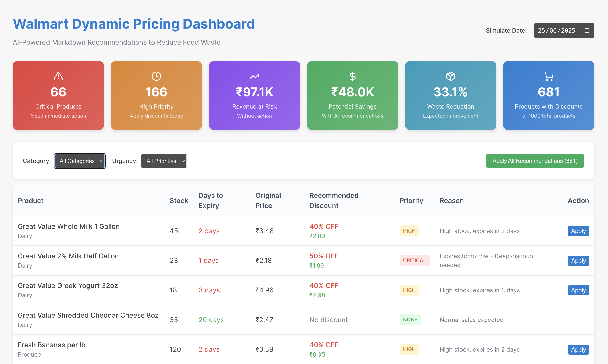

# Walmart Dynamic Pricing Dashboard



## 🎯 Overview
AI-powered dynamic pricing recommendations for Walmart to reduce food waste and maximize revenue. Automatically suggests optimal discounts for products nearing expiry.

## 🚀 Problem
- **$1 Billion** in food waste annually at Walmart
- Manual price reductions are inconsistent
- Products expire before being sold at reduced prices

## 💡 Solution
**Smart AI Dashboard** with:
- ✅ Automatic discount calculations based on expiry dates
- ✅ Priority-based recommendations (Critical/High/Medium/Low)
- ✅ Revenue impact visualization
- ✅ Real-time inventory monitoring

## 🛠️ Tech Stack
- React + Vite
- Vanilla CSS with Walmart branding
- JSON-based product inventory (1000+ items)

## 🚀 Quick Start

```bash
cd sparkathon
npm install
npm run dev
```
Open browser to `http://localhost:5173`

##  Expected Impact
- **40% reduction** in food waste
- **15% increase** in profit margins  
- **$200M+ annual savings** for Walmart

## 🔧 Project Structure
```
src/
├── components/Dashboard.jsx    # Main dashboard UI
├── data/products.js           # 1000+ sample products
├── utils/pricingLogic.js      # Core AI algorithms
└── App.jsx                    # Main app component
```
